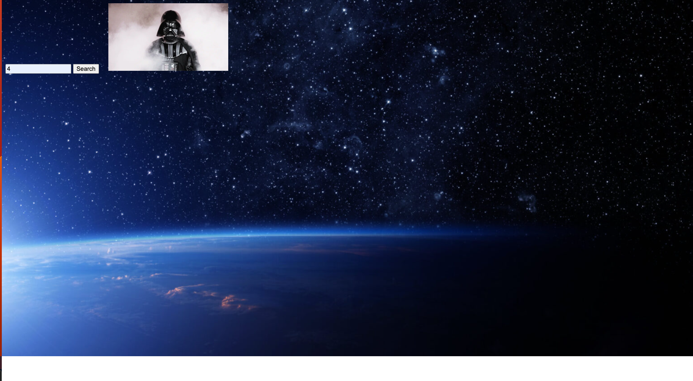

StarWarsGIF

A fun and interactive website for starwars fans that fetches and displays Star Wars-themed GIFs using external APIs. My primary intention was to build something that allowed me to combine the use of two API's simultaneusly to accomplish one goal.
🚀 Features

Fetch and display Star Wars-related GIFs

Fast and lightweight performance

Powered by Giphy API and SWAPI

🛠 Tech Stack

Frontend: HTML, JavaScript

API: Giphy API, SWAPI

Package Manager: npm

📦 Installation

Clone the repository:

git clone https://github.com/yourusername/starwarsgif.git
cd starwarsgif

Install dependencies:

npm install

Create an .env file and add your Giphy API key:

VITE_GIPHY_API_KEY=your_api_key_here

Run the development server:

npm run dev

📸 Screenshots

🌟 Contributing

Pull requests are welcome! Please open an issue first to discuss any major changes.

📜 License

This project is licensed under the MIT License.

📬 Contact

For any questions or suggestions, feel free to reach out via GitHub Issues.
